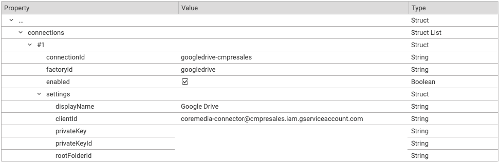

# Installation

--------------------------------------------------------------------------------

\[[Up](README.md)\] \[[Top](#top)\]

--------------------------------------------------------------------------------

## Table of Content

1. [Introduction](#introduction)
2. [Use Git](#use-git)
3. [Download Release](#download-release)
4. [Activate the Plugin](#activate-the-plugin)
5. [Configure the Plugin](#configure-the-plugin)
6. [Intellij IDEA Hints](#intellij-idea-hints)

## Introduction

Depending on your setup and your plans, you can integrate this project in different ways.

* If you want to use the plugin in your project, clone or fork the repository.
* If you do not want to use GitHub, proceed as described in [Download Release](#download-release).
* If you want to contribute a new feature or a bugfix, as an external developer, you need a fork of the repository to create a Pull Request.

## Use Git

Clone this repository or your fork. Make sure to use the suitable branch
for your workspace version (see [README](../README.md)). A fork is required if
you plan to customize the plugin.

Continue with [Activate the plugin](#activate-the-plugin).

## Download Release

Go to [Release](https://github.com/CoreMedia/content-hub-adapter-googledrive/releases) and download the version that matches your CMCC release version.
The ZIP file provides the Maven workspace of the plugin.

## Activate the Plugin

The googledrive contenthub adapter is a plugin for studio-server and studio-client.
The deployment of plugins is described [here](https://documentation.coremedia.com/cmcc-11/artifacts/2210/webhelp/coremedia-en/content/ApplicationPlugins.html).

In short, for a quick development roundtrip:
1. Build your Blueprint.
2. Build the `content-hub-adapter-googledrive`
   1. Run `mvn clean install` in the `studio-server` folder.

      Checkpoint: A zip file exists in `studio-server/target`. 
   2. Run `pnpm install && pnpm -r run build && pnpm -r run package` in the folder `studio-client`.
  
      Checkpoint: A zip file exists in `studio-client/apps/main/content-hub-adapter-googledrive/build`.
3. Create a directory for studio-server plugins, e.g. `/tmp/studio-server-plugins`,
   and copy `content-hub-adapter-googledrive/studio-server/target/studio-server.content-hub-adapter-googledrive-<version>.zip`
   into that directory.
4. Start the studio server as usual, e.g. `mvn spring-boot:run`, with an additional property `-Dplugins.directory=/tmp/studio-server-plugins`
5. Start the studio client with an additional property `-DadditionalPackagesDirs=/.../content-hub-adapter-googledrive/studio-client/target/app`

Now the plugin is running.  You won't yet notice it though, until you configure a connection
and restart the studio server.

## Configure the Plugin

Once having activated the plugin as described above, you can establish the connection to the external system by adding a Settings content to the site,
globally, or the user's home folder. The general Content Hub configuration is described in the
[Studio Developer Manual](https://documentation.coremedia.com/cmcc-11/artifacts/2210/webhelp/studio-developer-en/content/Content_HubAdapterConfiguration.html).
Additional adapter-specific configuration is shown in the screenshot below:

## Intellij IDEA Hints

For the IDEA import:
- Ignore folder ".remote-package"
- Disable "Settings > Compiler > Clear output directory on rebuild"
